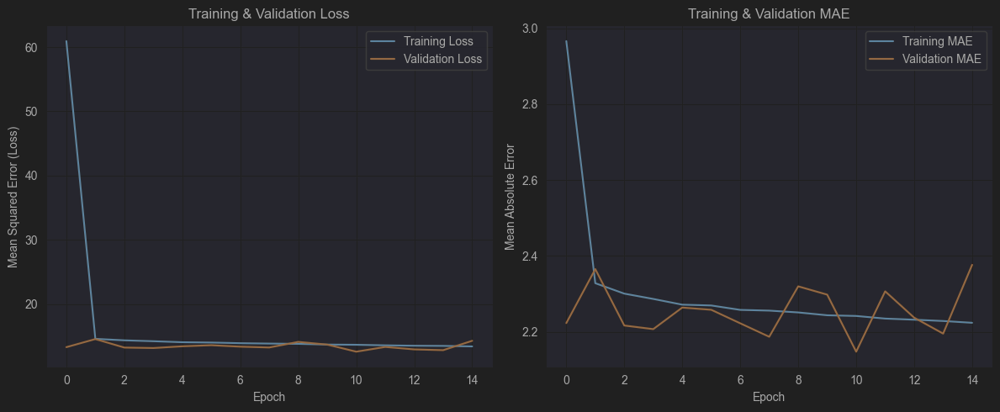

# Calorie Expenditure Prediction Based on Physical Activity

This project aims to build a machine learning model that can predict the number of calories burned during physical activity based on several attributes such as age, gender, workout duration, heart rate, and body temperature.

## Project Description

This model uses a physical exercise dataset to train a neural network with a simple deep learning architecture. The goal is to create an accurate regression model to estimate calorie expenditure, which can be useful in fitness and health applications.

## Dataset

The dataset used in this project comes from Kaggle and consists of two files:
* `train.csv`: Contains the training data used to train the model. It consists of 750,000 rows of data.
* `test.csv`: Contains the test data used for final predictions. It consists of 250,000 rows of data.

The dataset can be downloaded from the following link:
[Predict Calorie Expenditure on Kaggle](https://www.kaggle.com/datasets/adilshamim8/predict-calorie-expenditure)

**Features in the dataset:**
* **Age**: Age (Years)
* **Height**: Height (cm)
* **Weight**: Weight (kg)
* **Duration**: Activity Duration (Minutes)
* **Heart_Rate**: Average Heart Rate (bpm)
* **Body_Temp**: Body Temperature (°C)
* **Sex**: Gender (`male` / `female`)
* **Calories**: Number of Calories Burned (Prediction Target)

## Project Workflow

1.  **Library Import**: Import necessary libraries such as `pandas`, `numpy`, `matplotlib`, `seaborn`, `tensorflow`, and `scikit-learn`.
2.  **Data Loading**: Load `train.csv` and `test.csv` datasets into `pandas` DataFrames.
3.  **Data Preprocessing**:
    * Check for missing values.
    * Encode the categorical feature (`Sex`) into numerical values (0 for `female`, 1 for `male`).
    * Remove irrelevant columns like `id`.
    * Normalize the data using `StandardScaler` from `scikit-learn` to ensure each feature has a uniform scale.
4.  **Exploratory Data Analysis (EDA)**: Create a correlation heatmap to understand the relationships between features.
5.  **Model Building**:
    * Design a neural network architecture using `TensorFlow` and `Keras`.
    * The model has 1 input layer, 3 hidden layers with ReLU activation functions, and 1 output layer for regression.
    * Compile the model using the `adam` optimizer and `mean_squared_error` as the loss function.
6.  **Model Training**:
    * The model is trained on the training data for **15 epochs** with a batch size of 32.
    * 20% of the training data is used as a validation set to monitor the model's performance during training.
7.  **Model Evaluation**:
    * Visualize the loss (MSE) and metric (MAE) graphs for both training and validation data.
    * The model's performance is evaluated using the **R-squared (R²)** metric, which shows that the model can explain approximately **99.67%** of the variance in the calorie data on the training set.

## Model Architecture

The Sequential model used has the following architecture:

| Layer (type)    | Output Shape | Param # |
|:----------------|:-------------|:--------|
| dense (Dense)   | (None, 64)   | 512     |
| dense_1 (Dense) | (None, 64)   | 4,160   |
| dense_2 (Dense) | (None, 32)   | 2,080   |
| dense_3 (Dense) | (None, 1)    | 33      |

**Total params: 6,785**

## Training Results

The graph below shows the model's performance during 15 training epochs. It is clear that the loss and MAE values for both the training and validation sets decrease consistently, indicating that the model is learning effectively.



*Note: Replace `img.png` with a screenshot of your training visualization graph.*

## How to Run the Project

1.  **Clone the Repository**:
    ```bash
    git clone https://github.com/Ryftri/calories_nn.git
    cd calories_nn
    ```
2.  **Create a Virtual Environment**:
    ```bash
    python -m venv venv
    venv\Scripts\activate  # Windows
    # source venv/bin/activate  # macOS/Linux
    ```
3.  **Install Dependencies**:
    ```bash
    pip install -r requirements.txt
    ```
4.  **Run the Notebook**:
    Open and run the `calories.ipynb` file using Jupyter Notebook or Jupyter Lab.
    ```bash
    jupyter notebook calories.ipynb
    ```

## Libraries Used

* TensorFlow & Keras
* Scikit-learn
* Pandas
* NumPy
* Matplotlib
* Seaborn